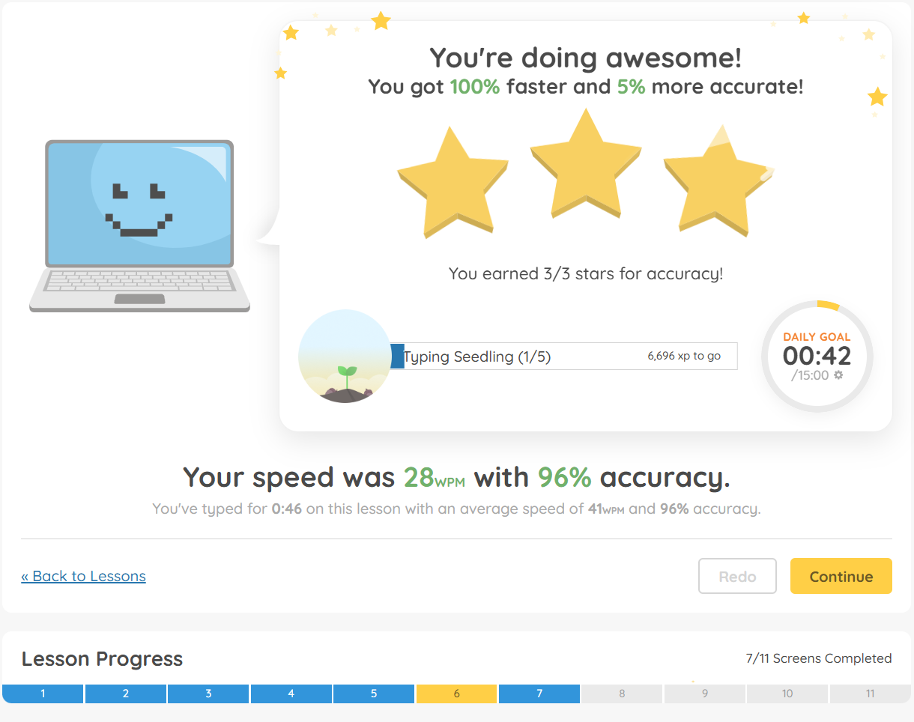

# Light Haven Cloud Games

This focuses on building a browser game that uses voice mechanics for games.

# Initial Inspiration - typing.com

The inspiration came from the site typing.com. See the link below

[Typing Lessons | J, F, and Space - Typing.com](https://www.typing.com/student/lesson/359/j-f-and-space)

Here is a video explaining the main functionality of it.

[typing-inspiration.mp4](https://drive.google.com/file/d/1GWk5oB0fyRtw6UeOsqh4UiV0Cjhwirq0/view?usp=sharing)

My daughter, who is 7 years old and has autism absolutely loved it. This is the main part of the game.

- [Typing.com](http://Typing.com) Game Mechanics
    1. The Music - its very bouncy and gives you this feeling that you should go fast
    2. The background images bounce. You have some images that move back and forth on the sides. And then the clouds shrink and grow and it moves across the screen.
    3. The goal is for the character to reach the highest platform in the level. Each level has a set number of platforms. The player starts on the bottom, and as you type 3 letters in a row, the character will jump to that next platform.
    4. When you type the first letters (except the last letter on the platform), the player moves closer to the edge of the platform
    5. When you type the final letter on the platform, the letters disappear and the player jumps onto that platform.
    6. At the end, there is an animation of the character showing the player that they reached the top
        
        
        
    7. Each letter type makes a “typing sound”
    8. Each time the character jumps, there is a boing sound (bounce sound)
    9. When they type the wrong sound, this sound plays
        
        [https://www.typing.com/dist/student/extras/sounds/error.mp3](https://www.typing.com/dist/student/extras/sounds/error.mp3)
        
    10. Typing sound
        
        [https://www.typing.com/dist/student/extras/sounds/key.mp3](https://www.typing.com/dist/student/extras/sounds/key.mp3)
        
    11. All action sounds played (combined in one file)
        
        [https://www.typing.com/dist/student/extras/game_files/keyboard-jump/assets/sounds.mp3](https://www.typing.com/dist/student/extras/game_files/keyboard-jump/assets/sounds.mp3)
        
    12. Then after the game, it goes into a “how you did” page
        
        
        
    13. Each lesson handles a new letter. We can do this for letters, numbers, then eventually blends, then words, then paragraphs

# Test Game Mechanics of Phoneme Classifier

Build a website that allows us to test game mechanics based on your voice. When you speak, the character reacts to your voice. Your voice is what controls the character.

Build an ad system to help us get money while we are in this?

<aside>
💡

Perhaps combine voice + controller? (Mouse/Keyboard/Controller)?

- This could be where the character is running towards some goal, and you mouse controls where the player goes. The voice is used to interact with other things in the world.
- Or you can move with arrow keys while the rest of the game uses your voice
</aside>

## Initial Game Ideas

<aside>
✨

### **Voice Clouds Adventure - Current Game**

- **Gameplay:** Players use their voice to make a character jump from platform (cloud) to another.
- **Mechanic:** Each platform (cloud) shows a phoneme; players pronounce it correctly to jump to the next cloud. Incorrect pronunciation causes the character to bounce and try again.
- Inspired by typing.com
- Video showing where I’m at
    - [Video showing current progress of this one](https://drive.google.com/file/d/1IDnpmshugg78CzD9I8IatUAljRt7onFZ/view?usp=sharing)
</aside>

<aside>
✨

### **Phoneme Garden Builder**

- **Gameplay:** Choose a flower, each flower is a certain phoneme. You choose it, then plant it, and you interact with the flower to make it grow.
- **Mechanic:** Players speak to the flower, and each time you say its phoneme, it grows.
</aside>

## Other Game Ideas from ChatGPT

<aside>
✨

### **Phoneme Magic Tower**

- **Gameplay:** Players ascend a magical tower using vocal commands.
- **Mechanic:** Each floor requires correctly pronouncing specific phonemes. Successfully saying phonemes opens magical doors or makes steps appear. Special effects like sparkles or magical sounds accompany correct pronunciation.
- **Dan’s Initial Impression:** This feels like we would need to get this idea more flushed out and define what “ascending the magical tower looks like”
</aside>

<aside>
✨

### **Jungle Phoneme Swing**

- **Gameplay:** Swing through a jungle on vines, controlled by the player's voice.
- **Mechanic:** Correctly pronounce phonemes to reach the next vine. Missed phonemes result in humorous animations, such as landing softly on leaves or playful bouncing.
- **Dan’s Initial Impression:** This may require a bit more logic than the other games since we have to get swinging working well, though still not that bad at all.
</aside>

<aside>
✨

### **Voice Bubble Pop**

- **Gameplay:** Floating bubbles appear containing phonemes.
- **Mechanic:** Players say the phoneme correctly to pop bubbles. Special bubbles can offer bonus points or playful animations, creating incentive and excitement.
- **Dan’s Initial Impression:** This might be a very fun one for the kids
</aside>

<aside>
✨

### **Phoneme Rocket Launch**

- **Gameplay:** Build and launch rockets into space using voice commands.
- **Mechanic:** Players pronounce phonemes to build sections of a rocket. Correct phonemes assemble the rocket piece by piece, culminating in a celebratory launch animation.
- **Dan’s Initial Impression:** Benefit to this one, is the rocket would need to prepare to launch, giving the phoneme more time to classify and it would be a lot natural.
</aside>

<aside>
✨

### **Voice Treasure Quest**

- **Gameplay:** Navigate a character through a maze filled with hidden treasures using voice.
- **Mechanic:** At each intersection or treasure chest, players pronounce phonemes to choose paths or unlock rewards. Incorrect pronunciation triggers humorous animations or friendly guiding voices.
- **Dan’s Initial Impression:** This might be interesting with the humorous animations. What if the letters come alive, and they are wacky repeating their sound to some kind of tune or something.
</aside>

<aside>
✨

### **Phoneme Pet Rescue**

- **Gameplay:** Players help cute pets stranded on floating islands.
- **Mechanic:** Players pronounce phonemes to create magical bridges or balloons, bringing pets safely down. Animations and joyful pet sounds reinforce correct answers.
- **Dan’s Initial Impression:** Kids absolutely love animals (at least mine do), so helping animals may be a good one.
</aside>

<aside>
✨

### **Dragon’s Phoneme Flight**

- **Gameplay:** Players help a dragon fly across beautiful landscapes using voice controls.
- **Mechanic:** Correctly pronounced phonemes cause the dragon to flap wings and move upward or forward. Mistakes result in gentle dives or playful loops.
- **Dan’s Initial Impression:** Sounds interesting. Though the game mechanic of gentle dives would need a better flow. ****
</aside>

<aside>
✨

### **Phoneme Carnival**

- **Gameplay:** Players enjoy carnival mini-games controlled by their voices.
- **Mechanic:** Games include phoneme target shooting, phoneme balloon darts, and vocal ring toss. Correct phoneme pronunciation grants points, tickets, and playful carnival sounds.
- **Dan’s Initial Impression:** Oh, this one sounds fun, though this is multiple mini-games, so its a longer game to build, though may not be that bad
</aside>