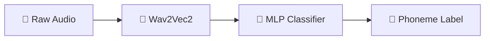

# 🎙️ Phoneme Classification Workflow - Developer Guide

Ever wondered how to teach a computer to understand speech sounds? This guide walks you through our complete pipeline that transforms raw audio recordings into a deployed machine learning model capable of real-time phoneme recognition.

**What you'll learn**: How to build a voice recognition system that can classify 37 different speech sounds (phonemes) with 85%+ accuracy in under 100ms - perfect for voice-controlled games and interactive applications.

## 🎯 What This System Does

Our phoneme classifier is like a super-smart ear that can:

- **Listen to speech** and identify individual sound units (phonemes like "ah", "bee", "ch")
- **Process audio in real-time** for interactive applications
- **Work in web browsers** without needing server connections
- **Handle noisy environments** with robust audio processing

Think of it as the brain behind voice-controlled games where players say "JUMP" or "RUN" to control their character.

## 🏗️ System Architecture Overview

The magic happens in two main stages:

1. **Feature Extraction** (Wav2Vec2): Converts raw audio into meaningful numerical representations
2. **Classification** (MLP Neural Network): Takes those features and predicts which phoneme was spoken



**Who should read this**: ML Engineers, Software Developers, Game Developers working with voice recognition

**Prerequisites**: 
- Audio files should be WAV format at 16kHz
- Training data organized by phoneme type
- Target deployment supports ONNX Runtime Web for browser apps

## 📋 Key Terms & Concepts

Before diving in, let's get familiar with the jargon:

- **Phoneme**: The smallest speech sound that distinguishes words (like the "p" in "pat" vs "bat")
- **Wav2Vec2**: Facebook's AI model that's really good at understanding speech patterns
- **MLP**: Multi-Layer Perceptron - a type of neural network that's fast and reliable
- **ONNX**: A format that lets you run AI models anywhere (browsers, phones, servers)
- **Embedding**: A numerical "fingerprint" that represents audio features
- **Inference**: The fancy term for "making predictions" with your trained model

## ⚡ Core Requirements & Performance Targets

### What the system must do

- ✅ **Recognize 37 phonemes** (see `phoneme_labels.json` for the complete list)
- ✅ **Process 1-second audio clips** at 16kHz sample rate
- ✅ **Achieve 85%+ accuracy** on validation data (targeting 95%+)
- ✅ **Respond in under 100ms** for real-time applications
- ✅ **Export to ONNX format** for cross-platform deployment
- ✅ **Stay under 50MB** total model size for web deployment

### Security & Privacy

- 🔒 **All audio processing happens locally** - no data leaves your device
- 🔒 **Model integrity checks** before loading

### Performance Constraints

- 💾 **Max 8GB RAM** during training
- 💾 **Max 2GB RAM** during inference
- 🔇 **Ignore audio below 0.01 amplitude** to filter out silence
- 📊 **Buffer up to 1000 samples** for audio trimming

### Development Guidelines

- 🎯 **Modular pipeline** - each step can run independently
- 📝 **Comprehensive logging** for debugging long operations
- 🛡️ **Graceful error handling** for missing files and invalid audio
- 🔢 **Use float32 precision** for all audio processing

## 🔌 API & Data Formats

### What goes in: Audio Input

Your audio needs to meet these specs:

```typescript
interface AudioInput {
  format: "WAV";           // Standard WAV files only
  sampleRate: 16000;       // 16kHz - the sweet spot for speech
  channels: 1;             // Mono audio (stereo gets converted)
  duration: 1.0;           // 1-second clips work best
  amplitudeThreshold: 0.01; // Ignore quiet background noise
}
```

### What comes out: Classification Results

```typescript
interface PhonemeClassification {
  predictedPhoneme: string;  // e.g., "b", "ch", "a_æ"
  confidence: number;        // How sure we are (0.0 to 1.0)
  logits: number[];         // Raw scores for all 37 phonemes
  processingTime: number;   // How long it took (in milliseconds)
}
```

### Under the Hood: ONNX Model Specs

Our system uses two models that work together like a relay race:

#### Model 1: Wav2Vec2 (Audio → Features)

```python
# Takes raw audio and extracts meaningful features
Input:  [1, audio_length]  # Raw audio samples
Output: [1, 768]           # Rich feature vector
```

#### Model 2: MLP Classifier (Features → Phoneme)

```python
# Takes features and predicts the phoneme
Input:  [1, 768]           # Features from Wav2Vec2
Output: [1, 37]            # Scores for each phoneme
```

### 📁 Project Structure & File Organization

Here's how the project is organized (think of it as your workspace):

```text
phoneme-classifier/
├── 🎤 recordings/                    # Your raw audio files (organized by phoneme)
├── 📦 dist/                         # Generated files (the good stuff!)
│   ├── organized_recordings/        # Cleaned & processed audio
│   ├── phoneme_embeddings/         # AI-ready feature files (.npy)
│   ├── phoneme_labels.json         # List of all 37 phonemes
│   ├── phoneme_classifier.pkl      # Trained classifier (Python)
│   ├── label_encoder.pkl          # Label mappings
│   ├── wav2vec2.onnx              # Feature extractor (ONNX)
│   └── phoneme_mlp.onnx           # Classifier (ONNX)
└── ⚙️ classification_workflow/      # Magic happens here (Python scripts)
```

### 📊 Data Tracking

We keep track of every file with a CSV metadata file:

```csv
phoneme,original_filename,new_filename,embedding_filename,duration,sample_rate
a_æ,recording_001.wav,a_æ_001.wav,a_æ_001.npy,1.0,16000
b,speaker2_bee.wav,b_002.wav,b_002.npy,1.0,16000
```

## ✅ Success Criteria (How we know it's working)

### Training Pipeline Success

- 🎯 **Audio Organization**: Raw recordings get cleaned and organized at 16kHz
- 🎯 **Feature Extraction**: Every audio file gets a corresponding `.npy` embedding file
- 🎯 **Model Training**: MLP achieves 85%+ accuracy (we're aiming for 95%!)
- 🎯 **Model Export**: Final ONNX models stay under 50MB combined

### Real-Time Performance

- ⚡ **Speed**: Classification happens in under 100ms
- 🔇 **Silence Handling**: System correctly ignores background noise
- 🎯 **Accuracy**: Predicted phonemes match expectations with 85%+ confidence

### Deployment Ready

- 🌐 **Browser Compatible**: ONNX models load successfully in web browsers
- 📱 **Real-Time Streaming**: Handles continuous audio without dropping frames

## 🧪 Testing Strategy (Making sure it actually works)

### How we test different parts

- **🔧 Unit Tests**: Test each workflow step individually with pytest
- **🔄 Integration Tests**: Run the complete pipeline with sample data
- **⚡ Performance Tests**: Measure speed and memory usage under load

### Test Setup

```python
# pytest configuration (already set up for you)
[tool:pytest]
testpaths = tests/
python_files = test_*.py
addopts = -v --tb=short --strict-markers
```

### Test Data We Use

- **🎵 Synthetic Audio**: Computer-generated sounds for consistent testing
- **🎤 Real Recordings**: Human speech samples for real-world validation
- **🔇 Edge Cases**: Testing silence, background noise, and weird audio

### Automated Quality Checks

- **Pipeline**: Code style → Unit tests → Integration tests → Performance checks
- **Coverage**: We aim for 80%+ code coverage
- **Benchmarks**: Automated speed and accuracy validation on every build

## 🤔 Why We Built It This Way

### Technology Choices Explained

**Why Wav2Vec2?**
Facebook's Wav2Vec2 is like having a universal translator for speech. It's been trained on massive amounts of audio and is really good at understanding speech patterns, even from different speakers and accents.

**Why MLP for Classification?**
We chose a Multi-Layer Perceptron because:

- ⚡ **Fast**: Simple architecture means quick predictions
- 🎯 **Reliable**: Well-understood and battle-tested
- 🔍 **Interpretable**: Easy to debug when things go wrong
- 💾 **Efficient**: Small model size perfect for web deployment

**ONNX Export Strategy**: Enables deployment across web browsers, mobile devices, and embedded systems without Python runtime dependencies. Separating feature extraction and classification allows independent optimization.

### Audio Processing Decisions

**16kHz Sample Rate**: Balances audio quality with computational efficiency. Sufficient for phoneme classification while keeping model sizes manageable.

**1-Second Windows**: Provides adequate temporal context for phoneme recognition while maintaining real-time responsiveness for interactive applications.

**Amplitude Thresholding**: Prevents misclassification of background noise and silence as phonemes, improving overall system reliability.

### Training Pipeline Design

**Sequential Workflow**: Modular design allows individual step debugging and incremental improvements. Each stage can be re-run independently during development.

**Design Decisions Explained:**

- **16kHz Audio**: Perfect balance between quality and file size
- **1-Second Windows**: Long enough to capture phonemes, short enough for real-time
- **Modular Pipeline**: Each step can be debugged and improved independently
- **Local Processing**: No internet required - privacy-friendly and always available

## 🔗 What You'll Need (Dependencies)

### Core ML Libraries

- **PyTorch**: The heavy lifting for training and model export
- **Transformers**: Gives us access to Wav2Vec2 pretrained models
- **Scikit-learn**: Simple, reliable tools for the MLP classifier
- **ONNX Runtime**: Makes models run everywhere (web, mobile, desktop)

### Audio Processing

- **SoundFile**: Reading and writing audio files
- **SoundDevice**: Real-time audio capture from microphones
- **Audiomentations**: Adding realistic noise and effects to training data

### Web Deployment

- **ONNX Runtime Web**: Run models in browsers without plugins
- **Web Audio API**: Capture microphone input in real-time
- **CDN**: Fast model delivery to users worldwide

### Development Tools

- **NumPy & Pandas**: Data wrangling and number crunching
- **Pytest**: Automated testing to catch bugs
- **Flake8**: Code style checking (keeps code readable)

## 💡 Practical Examples & Code Snippets

### Quick Start: Classify a phoneme (like in `s103_classify_voice_onnx.py`)

Here's how to use the trained models for real-time classification:

```python
import onnxruntime as ort
import numpy as np
from transformers import Wav2Vec2Processor

# 1. Load your trained models
wav2vec_session = ort.InferenceSession("dist/wav2vec2.onnx")
mlp_session = ort.InferenceSession("dist/phoneme_mlp.onnx")

# 2. Record or load audio (1 second at 16kHz)
audio = record_audio(duration=1.0, fs=16000)
processed = process_audio(audio)  # Clean up the audio

# 3. Extract features with Wav2Vec2
processor = Wav2Vec2Processor.from_pretrained("facebook/wav2vec2-base")
inputs = processor(processed, sampling_rate=16000, return_tensors="np")
embedding = wav2vec_session.run(None, {
    wav2vec_session.get_inputs()[0].name: inputs['input_values']
})[0]

# 4. Classify the phoneme
logits = mlp_session.run(None, {
    mlp_session.get_inputs()[0].name: embedding
})[0]

# 5. Get the result
predicted_index = np.argmax(logits[0])
confidence = np.softmax(logits[0])[predicted_index]

# Load phoneme labels and show result
with open("dist/phoneme_labels.json", "r") as f:
    phoneme_labels = json.load(f)
    
print(f"🎯 Detected phoneme: {phoneme_labels[predicted_index]}")
print(f"🎲 Confidence: {confidence:.1%}")
```

### Handling Common Issues

#### Problem: Silent or noisy audio

```python
def process_audio(audio):
    # Find where actual speech happens
    speech_parts = np.where(np.abs(audio) > 0.01)[0]  # Ignore quiet sounds
    
    if len(speech_parts) == 0:
        print("🔇 No speech detected - try speaking louder!")
        return None
    
    # Trim to just the speech with a little buffer
    start = max(0, speech_parts[0] - 1000)
    end = min(len(audio), speech_parts[-1] + 1000)
    trimmed = audio[start:end]
    
    # Normalize volume to prevent clipping
    if np.max(np.abs(trimmed)) > 0:
        trimmed = trimmed / np.max(np.abs(trimmed))
    
    return trimmed
```

### Organizing Your Training Data

Your audio files should be organized like this:

```bash
recordings/
├── a_æ/           # The "a" sound in "cat"
│   ├── speaker1_cat1.wav
│   ├── speaker1_cat2.wav
│   └── speaker2_cat1.wav
├── b/             # The "b" sound
│   ├── speaker1_bee1.wav
│   └── speaker2_bee1.wav
├── ch/            # The "ch" sound in "chair"
│   ├── speaker1_chair1.wav
│   └── speaker2_chair1.wav
└── silence.wav    # Background noise for training robustness
```

## ✅ Quality Checklist (How to know it's working well)

### Model Performance Standards

- 🎯 **Accuracy**: 85%+ correct predictions (aiming for 95%!)
- ⚡ **Speed**: Complete classification in under 100ms
- 💾 **Memory**: Under 2GB RAM during use, 8GB max during training
- 📦 **Size**: Final models under 50MB for fast web loading

### Audio Processing Quality

- 🎵 **Sample Rate**: All audio processed at consistent 16kHz
- ⏱️ **Duration**: 1-second audio clips work perfectly
- 📊 **Volume**: Audio normalized without distortion
- 🔇 **Silence**: Background noise properly ignored

### Deployment Readiness

- 🌐 **Browser Support**: Models work in all modern web browsers
- 📱 **Cross-Platform**: Same results on Windows, Mac, Linux, mobile
- 🔄 **Real-Time**: Handles continuous audio streams smoothly
- 🛡️ **Error Handling**: Graceful recovery from audio issues or model problems

### Development Quality

- 🔄 **Reproducible**: Same results every time you run the workflow
- 📊 **Data Integrity**: No files lost or corrupted during processing
- 📝 **Documentation**: CSV metadata matches actual files
- 📈 **Monitoring**: Clear progress updates during long operations

## 📚 Additional Resources

### Related Project Documentation

- [Voice-Controlled Platformer Game Architecture](../play-learn-quest/spec/spec-architecture-voice-controlled-platformer.md)
- [React-Phaser Integration Patterns](../play-learn-quest/spec/spec-design-react-phaser-integration.md)

### Learn More About the Technology

- [Wav2Vec2 Research Paper](https://arxiv.org/abs/2006.11477) - The science behind our feature extraction
- [ONNX Runtime Web Guide](https://onnxruntime.ai/docs/tutorials/web/) - How to deploy models in browsers
- [Web Audio API Docs](https://webaudio.github.io/web-audio-api/) - Real-time audio capture techniques
- [Phoneme Classification Survey](https://arxiv.org/abs/2008.03865) - Latest research in speech recognition

---

**🎯 Ready to get started?** Check out `s103_classify_voice_onnx.py` to see the classifier in action!
